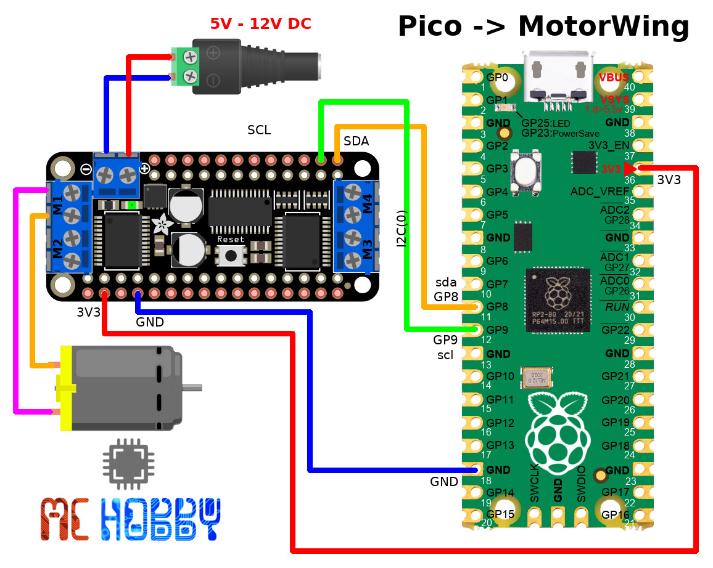
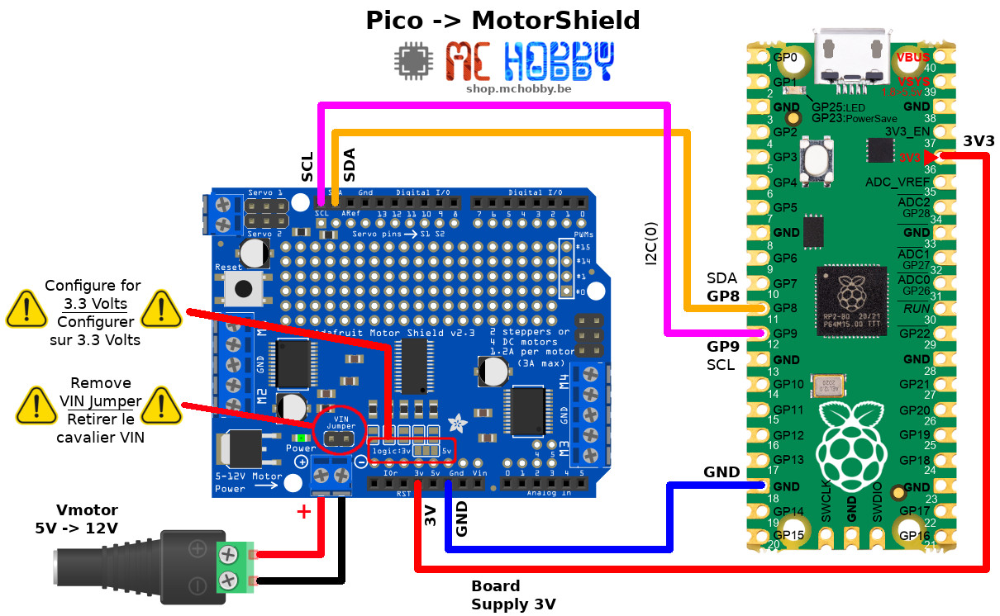
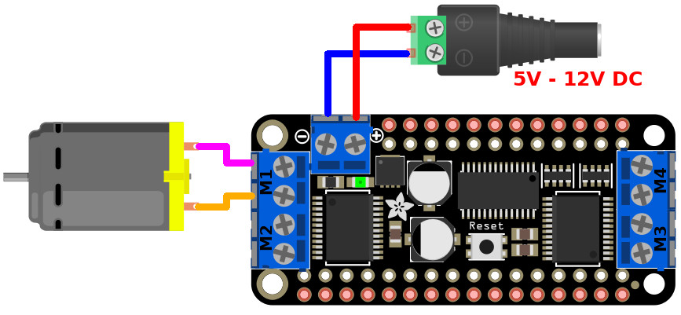

[Ce fichier existe également en FRANCAIS](readme.md)

__under translation__

# Adafruit Motor Shield / Motor Wing support for MicroPython
This library manage the [Adafruit MotorShield](https://shop.mchobby.be/fr/shields/379-shield-de-controle-moteur-motor-shield-v2-3232100003798-adafruit.html) / [Motor Wing from Adafruit](https://shop.mchobby.be/fr/feather-adafruit/830-featherwing-moteur-dc-pas-a-pas--3232100008304-adafruit.html) with various MicroPython plteform.


# Wiring
The motor shield board (u Motor Wing) can be used with several microcontroleurs board.

The schematics here under show the wiring between various MotorShield and various MicroPython board.

The motors wiring (dc motor, steppers, servos) are availables in the various test sections.

## Pyboard
With the Pyboard, you will need to power-up the MotorShield logic and use the I2C bus to allow data exchange with the motor shield.


## Pyboard-Uno-R3
The motor shield can quickly be wired by using the [Pyboard-Uno-R3 adapter](https://shop.mchobby.be/fr/micropython/1745-adaptateur-pyboard-vers-uno-r3-extra-3232100017450.html) and the [Pyboard-UNO-R3 libraries](https://github.com/mchobby/pyboard-driver/tree/master/UNO-R3).


## Pico - MotorWing
The motor FeatherWing can be wired directly to the [Raspberry-Pi Pico](https://shop.mchobby.be/fr/pico-raspberry-pi/2025-pico-rp2040-microcontroleur-2-coeurs-raspberry-pi-3232100020252.html) and used with the [motorwing.py](lib/motorwing.py) library.



## Pico - MotorShield
The motor Shield can be wired directly to the [Raspberry-Pi Pico](https://shop.mchobby.be/fr/pico-raspberry-pi/2025-pico-rp2040-microcontroleur-2-coeurs-raspberry-pi-3232100020252.html) and used with the [motorshield.py](lib/motorshield.py) library.

__Warning: the motor shield board must be configured for 3.3V__



# Test
To use this breakout, it will be necessary to install the following MicroPython library on the board by copying the following files on the board:
* `pca9685.py`
* `motorbase.py`
* `motorshield.py` : for the Adafruit MotorShield
* `motorwing.py` : for the Adafruit Motor FeatherWing


The various examples are stored in the folder:
* `examples/motorshield/` for the Adafruit's MotorShield (__contains all the reference examples__)

## DC motor on Motor Shield
It is possible to wire up to 4 DC motors on the M1, M2, M3, M4 terminals.


Here how to control the M2 DC motor.

```
from machine import I2C
from motorshield import MotorShield
from motorbase import FORWARD, BACKWARD, BRAKE, RELEASE
from time import sleep

# Pyboard & Pyboard-UNO-R3 - SDA=Y10, SCL=Y9
i2c = I2C(2)
sh = MotorShield( i2c )

motor = sh.get_motor(2) # Motor M2
try:
	motor.speed( 128 ) # Half speed
	motor.run( FORWARD )
	sleep( 2 )
	motor.speed( 255 ) # Full speed
	motor.run( BACKWARD )

	# Wait the user to stop the script
	# by Pressing Ctrl+C
	while True:
		sleep( 1 )
except KeyboardInterrupt:
	motor.run( RELEASE )
```

See also the example `examples/motorshield/test_dcmotors.py` testing all the functionalities on all the motor connectors.

## DC motor on Motor FeatherWing
It is possible to wire up to 4 DC motors on the M1, M2, M3, M4 terminals.



The following script [motorwing/test_dcmotor_m1.py](examples/motorwing/test_dcmotor_m1.py) just run the M1 DC motor.

```
from machine import I2C
from motorwing import MotorWing
from motorbase import FORWARD, BACKWARD, BRAKE, RELEASE
from time import sleep

# Pyboard - SDA=Y10, SCL=Y9
# i2c = I2C(2)
# ESP8266 sous MicroPython
# i2c = I2C(scl=Pin(5), sda=Pin(4))
# Raspberry-Pi Pico - SDA=GP8, SCL=GP9
i2c = I2C(0)

# Test the various motors on the MotorShield
sh = MotorWing( i2c )
motor = sh.get_motor(1) # Motor M1
try:
	motor.speed( 128 ) # Initial speed configuration
	motor.run( FORWARD )
	# Wait the user to stop the script
	# by Pressing Ctrl+C
	while True:
		sleep( 1 )
except KeyboardInterrupt:
	motor.run( RELEASE )

print( "That's all folks")
```

The only difference between this example for MotorWing and the MotorShield is the controler class `MotorWing` imported from `motorwing.py` .

As a consequence: the stepper examples and DC motors examples will also works with the MotorWing. Just replace the import statement and the created class.

## Stepper motor on Motor Shield
Controling a stepper motor is quite simple. Here is a basic example, additional examples are available lower in this section.


```
from machine import I2C
from motorshield import MotorShield
from motorbase import SINGLE, DOUBLE, INTERLEAVE, MICROSTEP

# Pyboard & Pyboard-UNO-R3 - SDA=Y10, SCL=Y9
i2c = I2C(2)
sh = MotorShield( i2c )

# Stepper S1 (M1+M2)
stepper = sh.get_stepper( 200, 1 )
stepper.speed = 3
stepper.step( 200, dir=FORWARD, style=DOUBLE )
sleep( 2 )
stepper.step( 200, dir=BACKWARD, style=DOUBLE )
```

## test_steppers.py on Motor Shield
The `examples/motorshield/test_steppers.py` example test the various style for controling the couls of the steppers on  S1 (M1+M2) and S2 (M3+M4) outputs.

The control styles are the followings:
* SINGLE : one coil activated (energy saving)
* DOUBLE : two coils activated (maximise the torque)
* INTERLEAVE : 1/2 step (better precision)
* MICROSTEP : 1/16 steps

This [Youtube video](https://youtu.be/mRv0d036vCg) show the 4 mode used.

Which produce the following results on the REPL output:

```
MicroPython v1.11-473-g86090de on 2019-11-15; PYBv1.1 with STM32F405RG
Type "help()" for more information.
>>> import test_steppers
Stepper S1
 +-> SINGLE coil activation for full turn (energy saving)
 +-> DOUBLE coil activation for full turn (stronger torque)
 +-> INTERLEAVE for half turn (more precise)
 +-> MICROSTEP 1/16 for half turn
 +-> RELEASE motor
Stepper S2
 +-> SINGLE coil activation for full turn (energy saving)
 +-> DOUBLE coil activation for full turn (stronger torque)
 +-> INTERLEAVE for half turn (more precise)
 +-> MICROSTEP 1/16 for half turn
 +-> RELEASE motor
>>>
```

## test_stepper_speed.py on Motor Shield
The `examples/motorshield/test_stepper_speed.py` example update the rotation speed accordingly to the potentiometer position.

The RPM speed is limited the the maximum throughput rate of I2C bus since each step made on the motor is the result of state changes on the PCA9685 PWM controler.

The I2C communication time is not taken into account when calculating the RPM and the impact on the I2C timing impact increases when the step/sec (RPM) increases.

```
from machine import I2C
from motorshield import MotorShield
from motorbase import FORWARD, BACKWARD, SINGLE, DOUBLE
from pyb import ADC

# Pyboard & Pyboard-UNO-R3 - SDA=Y10, SCL=Y9
i2c = I2C(2)
sh = MotorShield( i2c )

def arduino_map(x, in_min, in_max, out_min, out_max):
    return int((x-in_min) * (out_max-out_min) / (in_max-in_min) + out_min)

adc = ADC('X19')

# Test the various speed for a stepper on the MotorShield
stepper = sh.get_stepper( 200, 1 )
while True:
	val = adc.read() # Value between 0 et 4095
	rpm = arduino_map( val, 0, 4095, 1, 100 )
	print( "%s RPM" % rpm )
	stepper.speed = rpm
	stepper.step( 40, dir=FORWARD, style=DOUBLE )
```

This [Youtube video](https://youtu.be/9pRrGbrzA4g) shows the script in action.

## Servo-Motor and PWM (on MotorShield ONLY)

The MotorShield board offers 4 PWM output labelled #15, #14, #1 and #0.
Those PCA9685 outputs can be used to generates PWM and to control servo motors.

The graphics here under shows the 2 use cases (PWM and servo).

__WARNING:__ never apply a power supply over 5V to power-up servo-motor (usually, 6V is absolute maximum).


The following script shows how to control a servo wired on the output #15

```
from machine import I2C
from motorshield import MotorShield
from time import sleep

# Pyboard & Pyboard-UNO-R3 - SDA=Y10, SCL=Y9
i2c = I2C(2)
sh = MotorShield( i2c, freq=50 )

servo = sh.get_servo( 15 )

servo.angle( 90 )
sleep( 2 )
servo.angle( 0 )
sleep( 2 )
servo.angle( 180 )
sleep( 2 )
servo.angle( 90 )
sleep( 2 )

servo.release() # libérer le servo
```

This [YouTube video](https://youtu.be/jKfkatqdVW8) shows the script in action.

__Important notice__: The ideal PWM frequency used to control a servo is 50 Hertz (why we used the `freq=50` parameter when creating the `MotorShield` instance). __The default PWM frequency of the MotorShield (500 Hz) is quite to high__ and few servo will work at 500 Hz PWM. Depending on the servo motor quality, you will be able to use a frequency higher than 50 Hz. In some case, a 100 to 300 Hz PWM frequency can be used with servo motor which will be best if you want to manage the motorshield with stepper and DC motors.

The following example show how to manage a PWM output to control LED intensity.

```
from machine import I2C
from motorshield import MotorShield
from time import sleep

# Pyboard & Pyboard-UNO-R3 - SDA=Y10, SCL=Y9
i2c = I2C(2)
sh = MotorShield( i2c )

# PWM on output #0
pwm = sh.get_pwm( 0 )

# Signal HIGH
pwm.duty_percent( 100 )
sleep( 2 )
# Signal LOW
pwm.duty_percent( 0 )
sleep( 2 )
# Duty cycle @ 50%
pwm.duty_percent( 50 )
sleep( 2 )

# Duty cycle can be finely tuned with a value between 0 (LOW) and 4095 (HIGH)
# Duty cycle at 2866 (so 70%)
pwm.duty( 2866 )
sleep( 2 )

# Release PWM
pwm.duty( 0 ) # or duty_percent( 0 )
```

Please, note that `PWM` method calls are relayed to the `PCA9685` classe (the used pin if provided by the MotorShield).

# Credit
The code is based on the wonderfull work of [Mr Boulanger from CentralSupélec](https://wdi.supelec.fr/boulanger/MicroPython/AdafruitMotorShield).

The original code have been modified to get an API closer from MotorShield library for Arduino.

# Ressource
* [Arduino's Adafruit_MotorShield library documentation](http://adafruit.github.io/Adafruit_Motor_Shield_V2_Library/html/class_adafruit___motor_shield.html)
* [Original code from Frédéric Boulanger - CentralSupélec](https://wdi.supelec.fr/boulanger/MicroPython/AdafruitMotorShield)

## Shopping list
* [Adafruit's MotorShield](https://shop.mchobby.be/fr/shields/379-shield-de-controle-moteur-motor-shield-v2-3232100003798-adafruit.html) available at MCHobby
* [Adafruit's Feather MotorWing](https://shop.mchobby.be/fr/feather-adafruit/830-featherwing-moteur-dc-pas-a-pas--3232100008304-adafruit.html) available at MCHobby
* [Pyboard-UNO-R3 adapter](https://shop.mchobby.be/fr/micropython/1745-adaptateur-pyboard-vers-uno-r3-extra-3232100017450.html) available at MCHobby
* [MicroPython board](https://shop.mchobby.be/fr/56-micropython) available at MCHobby
* [Raspberry-Pi Pico](https://shop.mchobby.be/fr/pico-raspberry-pi/2025-pico-rp2040-microcontroleur-2-coeurs-raspberry-pi-3232100020252.html) available at MCHobby
