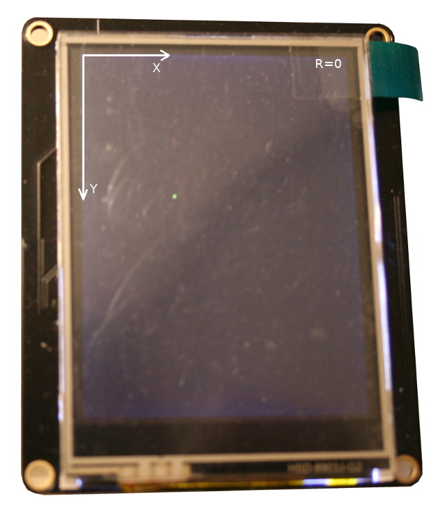
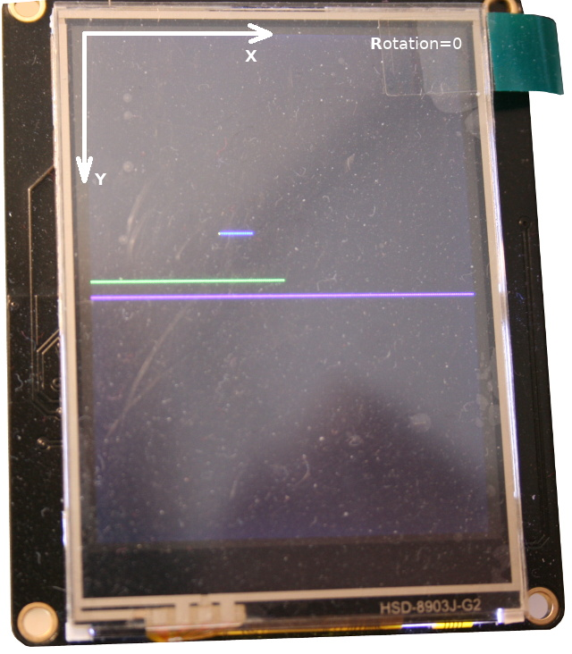
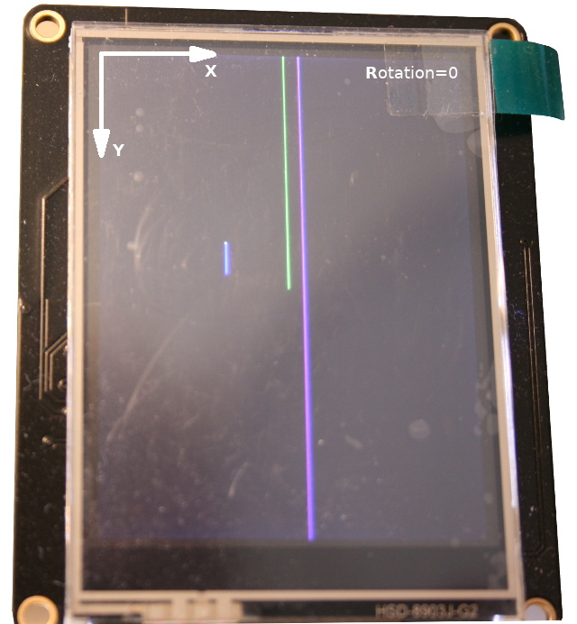
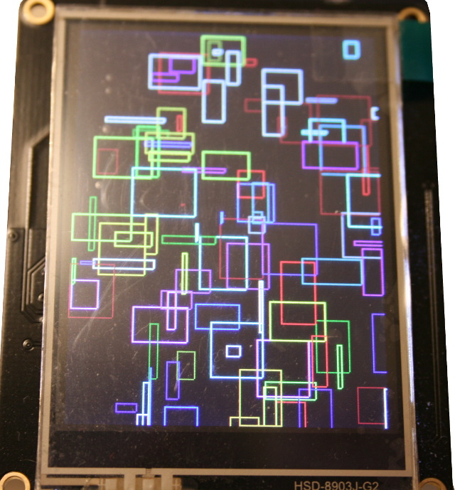
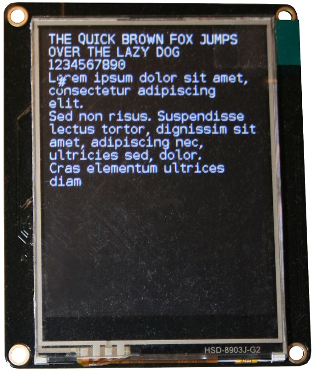

# ILI934x API

This file contains the description of the API used on the ILI934x drivers.

This driver use RGB565 16bits colors encoded into an 16 bits integer with the `color565(r, g, b)` library function.

# Library functions and constants

## Color constants
The library already includes somes COLOR constant which are the follow:
`BLACK, NAVY, DARKGREEN, DARKCYAN, MAROON, PURPLE, OLIVE, LIGHTGREY, DARKGREY,
BLUE, GREEN, CYAN, RED, MAGENTA, YELLOW, WHITE, ORANGE, GREENYELLOW`

## color565(r, g, b)

Encode a 24 bits color where `r`, `g`, `b` are values between 0 & 255.

The function returns a RGB565 integer value (fits into a 16 bits integer).

# ILI9341 class - General feature

## __init__( spi, cs, dc, rst, w, h, r )
* spi: initialised machine.spi bus attached to the TFT
* cs: pin name of TFT _Chip Select_ line. Will be initialized by the driver.
* dc: pin name of TFT _Data Command_ line. Will be initialized by the driver.
* rst: (optional) pin name of TFT _Reset_ line. Can be None when not used. Will be initialized by the driver.
* w: TFT width in pixels
* h: TFT height in pixels
* r: rotation (see _rotation_ property here below).

Initialisation of the TFT screen and its property.
Also initialize the default colors for foreground (white) and background (black).

Here is the minimal code for starting the driver as shown in the [test_main.py](examples/test_main.py) example.

``` python
from ili934x import ILI9341
from machine import Pin, SPI

# PYBStick config (idem with PYBStick-Feather-Face)
spi = SPI( 1, baudrate=40000000 )
cs_pin = Pin("S15")
dc_pin = Pin("S13")
rst_pin = None

# r in 0..3 is rotation, r in 4..7 = rotation+miroring
lcd = ILI9341( spi, cs=cs_pin, dc=dc_pin, rst=rst_pin, w=320, h=240, r=0)

lcd.erase()      # Clear the screen
lcd.set_pos(0,0) # Original cursor position for text display
lcd.print("Hello world")
```

## set_color( fg, bg )

Set the forground dans backgound color with color565 integers. color565 color integer can be generated with are generated with the `color565(r, g, b)` function.

the properties `color` and `bgcolor` can be used to set individual the colors.

## blit( bitbuff, x, y, w, h )

Draw a monochrome bitbuff FrameBuffer (MONO_VLSB) at a positions. This method is used by font drawing routines.

* White color (1) are drawed with the `color` foreground color.
* Black color (0) are drawed with the `bgcolor` background color.

# ILI9341 class - Properties

## bgcolor
Set the background 565color.

## color
Set the pen/forground 565color.

## font
Gives access to the created `FontDrawer` instance. That instance is used by the `print()` & `write()` methods for drawing text on the display.

The `FontDrawer` instance offers access to many property about the drawer and the underlaying font.

Use:
* `lcd.font` to acces the font drawer properties (eg: lcd.font.spacing for space between chars)
* `lcd.font.font` to acces the loaded font properties (eg: lcd.font.font.descender for the #pixels required for descender drawing)

## font_name
When assigned, this property creates and initialize the [FontDrawer class](https://github.com/mchobby/freetype-generator) for a given font name.

The _fontname.bin_ file must be present in the current directory. Binary font files can be downloaded from the [FreeType-Generator project](https://github.com/mchobby/freetype-generator) (see the `upy-fonts` subfolder)

``` python
lcd = ILI9341( spi, cs=cs_pin, dc=dc_pin, rst=rst_pin, w=320, h=240, r=0)
lcd.font_name = 'veram_m15'
```

## height, width
Height and width of the screen in pixel. These values are permutated accordingly to the screen _rotation_ .

## rotation
Display content rotation as defined @ class creation.

* rotation in 0..3: rotation.
* rotation in 4..7: rotation+miroring

1 & 3 = __landscape__ with width=320 height=240

0 & 2 = __portrait__ with width=240 height=320

## scrolling
Returns a boolean value stating of the scrolling state. This may append when displaying text with many lines.

This is resetted by `reset_scroll()` method.

# ILI9341 class - Drawing primitives

## erase()

Clear the screen content with the background color (black).

## fill( c )
__FrameBuffer MIMIC__

Fill the screen with a given color.


## pixel( x, y, color=None )

__FrameBuffer MIMIC__

Draw a pixel at x,y position with the given color565.

If color=`None` then it returns the color565 of the `x,y` pixel.

See the example [test_pixel.py](examples/test_pixel.py)



## hline( x, y, w, c, tick=1 )

__FrameBuffer MIMIC__

Draw an horizontal (optimized) having `w` pixels large line from the `x`,`y` position with the given `c` (color565).

The `tick` extra parameter (tickness) with __default value 1__ can be used to draw ticker lines :-)

See the example [test_hlines.py](examples/test_hlines.py)



## vline( x, y, h, c, tick=1 )

__FrameBuffer MIMIC__

Draw vertical line (optimized) having `h` pixels height. see `hline()` for description.

See the example [test_vlines.py](examples/test_vlines.py)  



## rect( x,y, w,h, c )

__FrameBuffer MIMIC__

Draw a rectangle with top-left corner at `x,y` and having `w` pixels width & `h` pixels height.



## fill_rect( x,y, w,h, c )

__FrameBuffer MIMIC__

Same as `rect()` except that it fills the rectangle.

Draw and fill a rectangle with the 565color value.
* x: x starting position
* y: y starting position
* w: rectangle width
* h: rectange height
* color: 16bit color to fill with (otherwise it use the background color)

See example [test_fill_rect.py](examples/test_fill_rect.py)


# ILI9341 class - Text display

Prior to print any text, the `font_name` property must be assigned with a valid font name (eg: `vera_m15` for vera_m15.bin binary font file).

The text display routine inside the driver does manage the `\n` character to wrap lines.

See the examples [test_print.py](examples/test_print.py) as HowTo Guide.



Please note:
* text drawing on screen relies on `FontDrawer` class (fdrawer.py). This library can be installed from the dependencies.zip .
* Many font files (.bin) are available from the FreeType-Generator project @ https://github.com/mchobby/freetype-generator .
* A `FrameDrawer`class can also draw directly text on a ILI934x driver as showned in the [test_fdrawer.py](examples/test_fdrawer.py) .

## set_pos( x, y )

Set the cursor position @ x,y position. Also impact the text display routine.

## chars( str, x, y )

Draw one or several characters at arbitrary x,y position on the screen.

Does not modifies the x,y cursor position.

Returns: x+string_length

## print( text )

Draw text on screen (word by word) with WORD wrap and scrolls the screen when going over the display area.

Print text on a new line @ each `print()` call.

``` python
lcd = ILI9341( spi, cs=cs_pin, dc=dc_pin, rst=rst_pin, w=320, h=240, r=0)
lcd.erase()
lcd.font_name = 'veram_m15'

lcd.print( "THE QUICK BROWN FOX JUMPS OVER THE LAZY DOG 1234567890" )
lcd.color = GREEN
lcd.print( "Lorem ipsum dolor sit amet, consectetur adipiscing elit." )
lcd.color = BLUE
lcd.print( "Sed non risus. Suspendisse lectus tortor, dignissim sit amet, adipiscing nec, ultricies sed, dolor." )
lcd.color = YELLOW
lcd.print( "Cras elementum ultrices diam" )
```
Note:
* __Requires__ the `font_name` to be assigned.
* Leaves x unchanged, so lines can be displayed within a column from `set_pos(x,y)` .
* __Bug:__ screen scrolling is now working properly in rotation 3!

## write( text )

__WARNING:__ not tested yet.

Draw text on a line with CHARACTER wrap at the end of the line. Also support line wrap with `\n`.

Note: Compatible with stream output.

__Bug:__ CHARACTER wrap at the end of the line does raise en TypeError in rotation 3!

## next_line( cury, char_h )

TO DOCUMENT

## scroll( dy )

Make the screen scrolling by `dy` pixels (can be negative).

Useful to create scrolling text.

## scroll_reset()

Reset the scroll feature.
